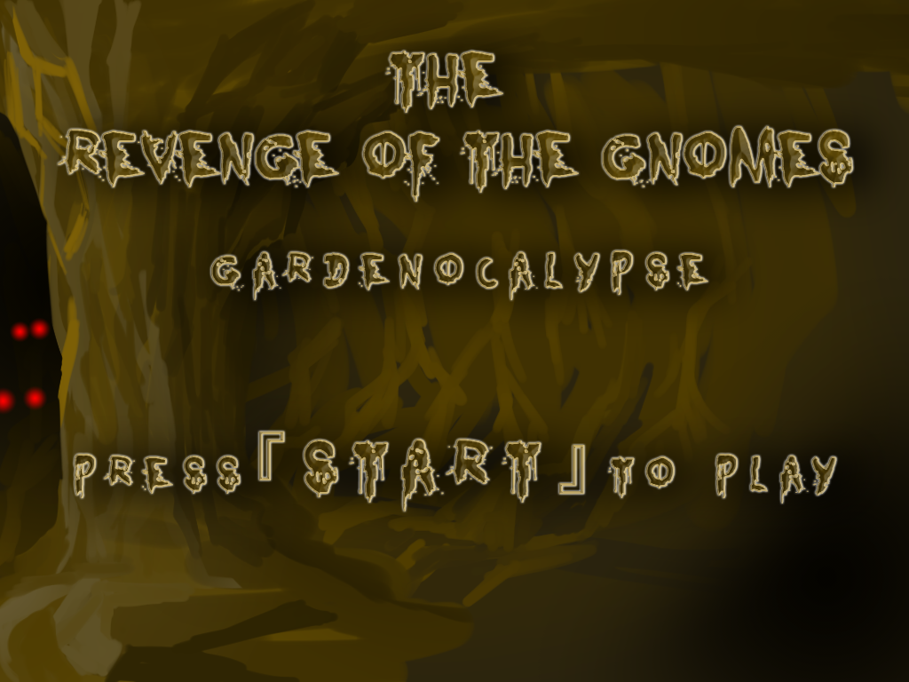
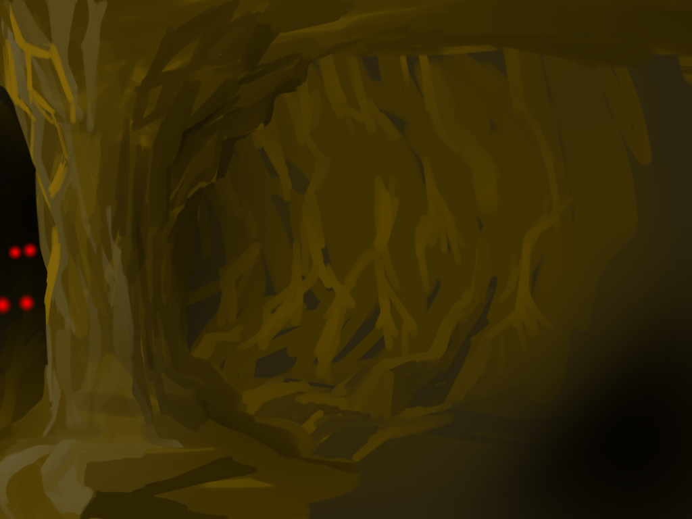
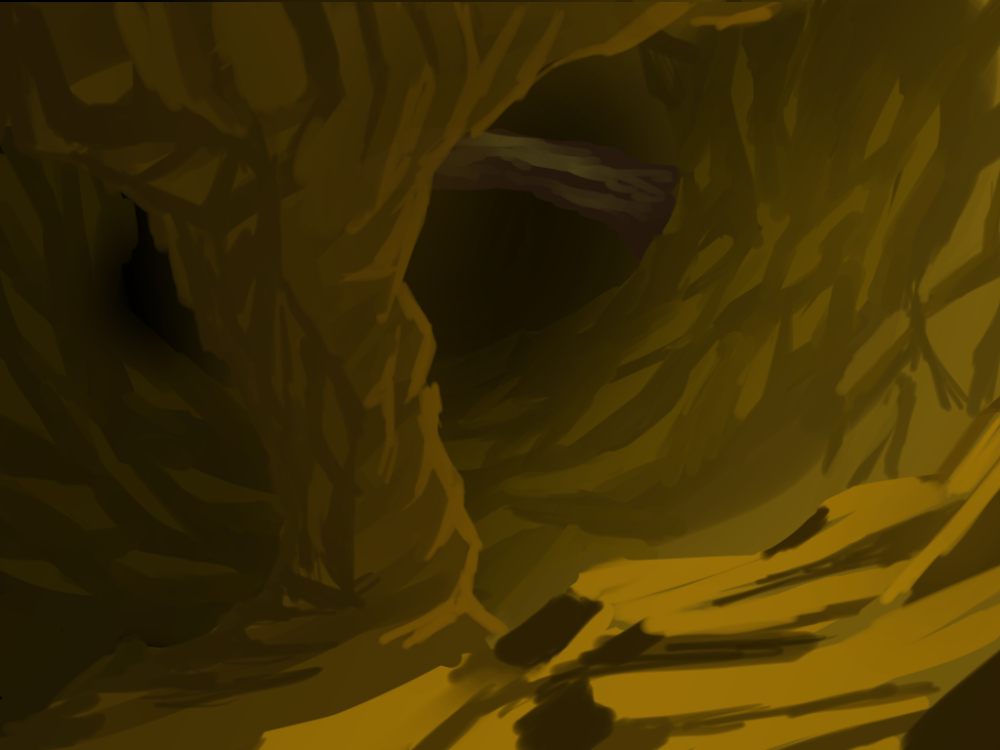
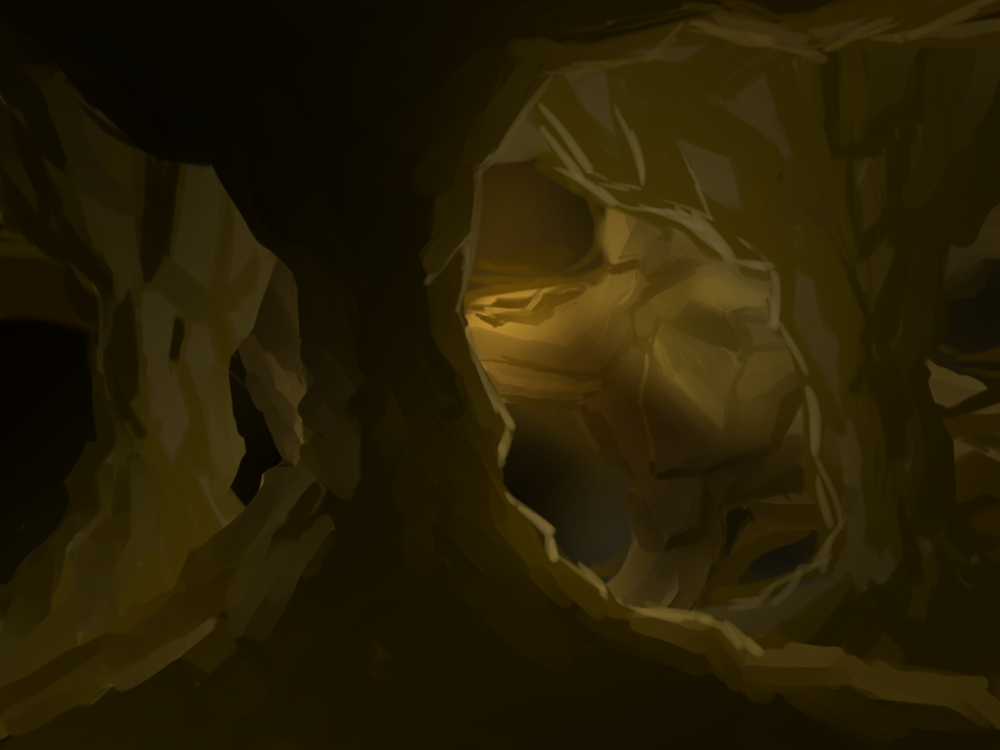
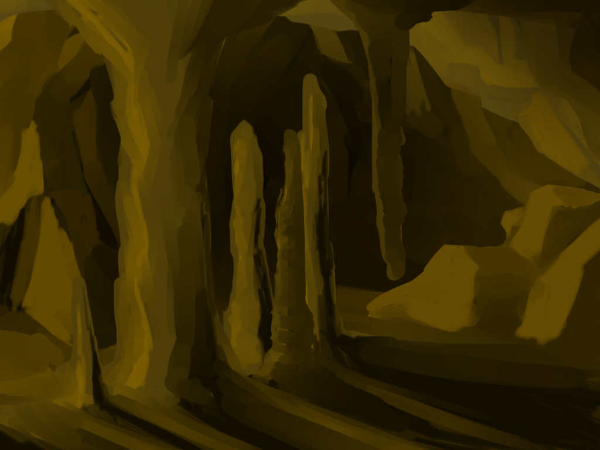
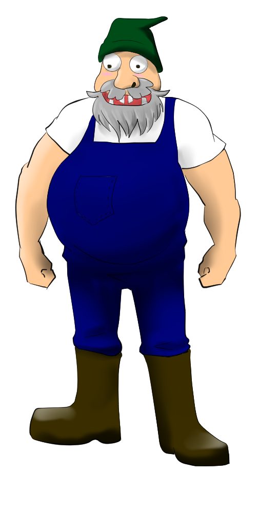

# Creative Jam 2017 - Edition 8

- Montreal - Centre NAD
- May 13 to 15, 2017

# Description
This project has been made during the creative jam 2017 where we had 46h to build a game.
The theme was 'minuscule' with a technical constraint: AI.
- 2 players game
- One plays a big garden gnome and fights AI enemies to survive
- Second plays a little garden gnome that need to run fast and open the front doors
- The goal is to pass all the doors before 'big garden gnome' is overrun

# Art

# AI
AI is implemented by a finite state machine.
(All components are under 'Assets/AI' folder.)
Each state define the enemy behaviors and, according to events, knows the following possible states (State pattern).
States are instanciated by a factory.
 States are:
- Look4Player : enemy looks for the player and go in its direction. (Basically see at a defined range)
- ChargePlayer: enemy tries to go on charge range and charge
- BlockAttack : enemy can't move but block player and receives less damage
- MeleeAttack : enemy is fighting, if player flee, run after him or take distances to charge again.
- RunAway : enemy flee the fight and call a friend for help (This one will block)

# Build
- Tested under Unity v4
- Our game is only a prototype and is not fully playable.

# Team
- Constantin [geekymoose](https://github.com/GeekyMoose) - Programmer
- Kerby [kerby99](https://github.com/kerby99) - Programmer
- I-an - 2D artiste
- Annie-Claude - Game Designer
